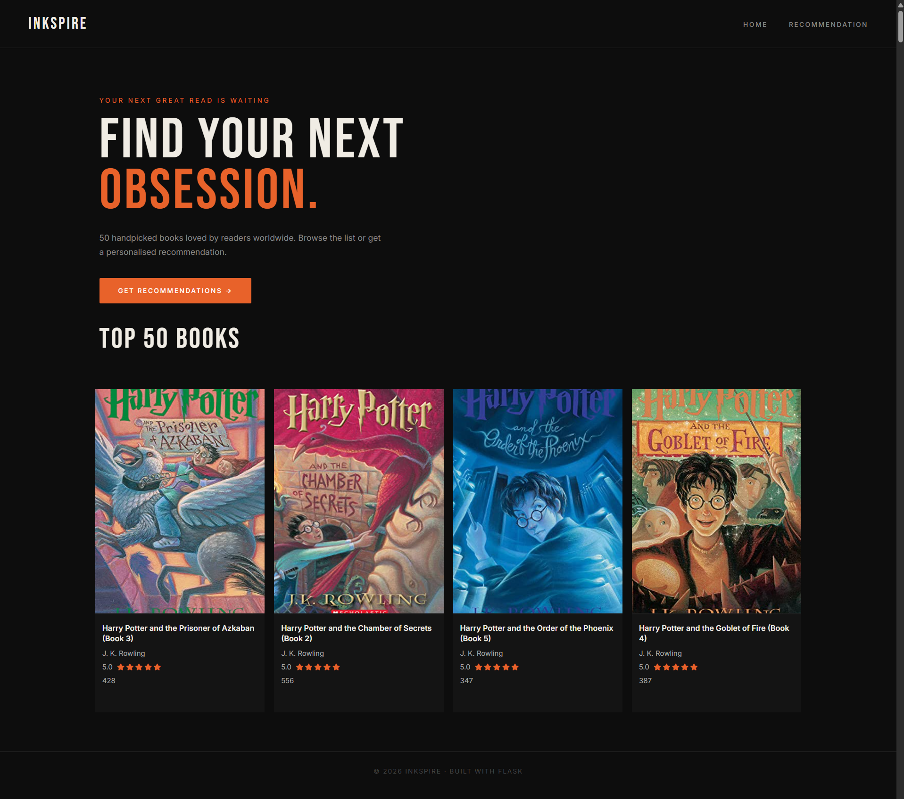
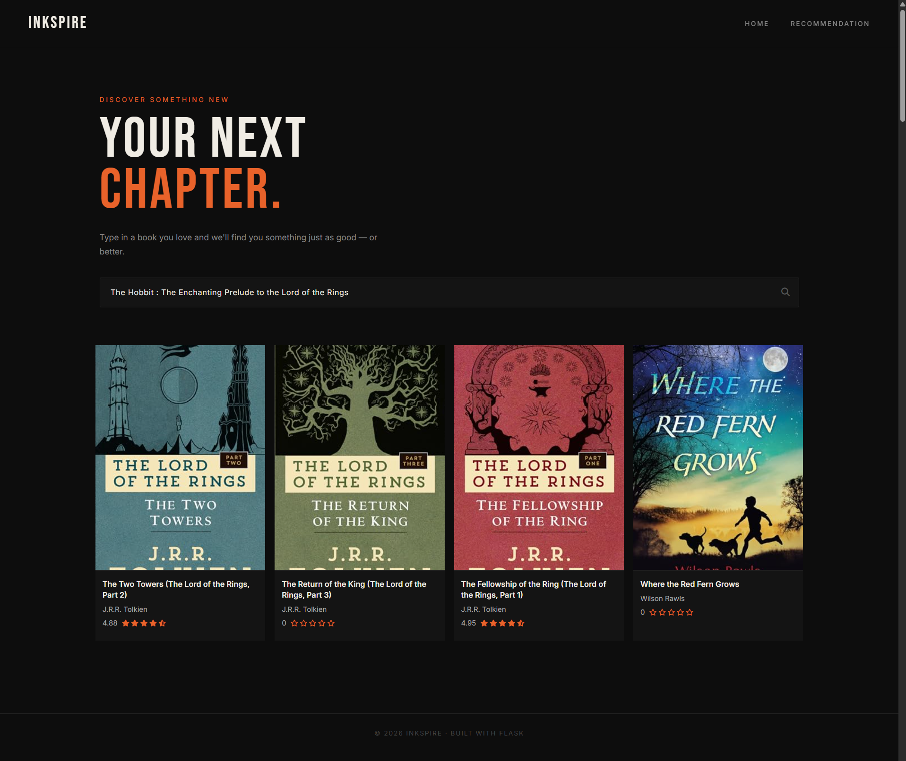

# Inkspire — Book Recommendation System

A web-based book recommendation system built with Flask that helps readers discover their next great read. Browse the top 50 most popular books or get personalised recommendations based on a book you already love — powered by collaborative filtering.

🔗 **Live Demo:** [Add your Render URL here]

---

## Screenshots
### Home Page


### Recommendation Page

---

## Features

- Browse the **Top 50 books** ranked by number of ratings and average score
- **Personalised recommendations** — type in a book title and get 10 similar suggestions instantly
- Star ratings and vote counts for every book
- Fallback handling — if a recommended book isn't in the top 50, it still shows with author and cover from the full books dataset
- Clean dark theme with smooth hover effects

---

## How It Works

### Home Page — Top 50 Books
The home page loads from `popular.pkl`, a pre-processed dataframe of the 50 most rated books. For each book it displays the title, author, cover image, average rating, and number of ratings.

### Recommendation Engine
The recommendation page uses **collaborative filtering** based on user rating patterns:

1. User types a book title and submits the form via POST to `/recommend_books`
2. The app looks up the book's index in `pt_df` — a pivot table where rows are book titles and columns are user IDs, with rating values filled in
3. **Cosine similarity** scores (pre-computed and stored in `similarity_score.pkl`) are retrieved for that book
4. The top 10 most similar books are returned, sorted by similarity score (excluding the searched book itself)
5. For each result, the app first checks `popular_df` for full details — if not found, it falls back to the full `books` dataset
6. Results are rendered with title, author, cover image, and star rating (defaults to 0 if no rating data exists)

---

## Tech Stack

| Layer | Technology |
|---|---|
| Backend | Python 3, Flask |
| Frontend | HTML5, CSS3, Bootstrap 4 |
| Data processing | Pandas, NumPy |
| Recommendation | Cosine similarity (Scikit-learn) |
| Model storage | Pickle (.pkl files) |
| Fonts | Google Fonts — Bebas Neue, Inter |
| Icons | Font Awesome 6 |

---

## Project Structure

```
BOOK RECOMMENDATION SYSTEM/
├── static/
│   ├── style.css               # Dark theme styling
│   ├── Logo.svg              
│   ├── BRS Logo.png    
│   ├── index.png              
│   └── recommendation.png
├── templates/
│   ├── index.html              # Home page — Top 50 books
│   └── recommend.html          # Recommendation page
├── datasets/
│   ├── Books.csv               # Raw books data
│   ├── Ratings.csv             # Raw ratings data
│   └── Users.csv               # Raw users data       
├── app.py                      # Flask routes and logic
├── data_pipeline.ipynb         # Data processing and model training
├── books.pkl                   # Full books dataset
├── popular.pkl                 # Top 50 popular books
├── pt_df.pkl                   # User-book pivot table
├── similarity_score.pkl        # Pre-computed cosine  similarity matrix
├── requirements.txt            # Python dependencies
└── README.md
```

---

## Run Locally

1. **Clone the repository**
   ```bash
   git clone https://github.com/karlyndiary/Book-Recommendation-System
   cd Book-Recommendation-System
   ```

2. **Install dependencies**
   ```bash
   pip install -r requirements.txt
   ```

3. **Run the app**
   ```bash
   python app.py
   ```

4. Open your browser and go to `http://127.0.0.1:5000`

---

## Dataset

This project uses the [Book Recommendation Dataset](https://www.kaggle.com/datasets/arashnic/book-recommendation-dataset), which contains:

| File | Description |
|---|---|
| Books.csv | Book titles, authors, cover image URLs |
| Ratings.csv  | User ratings (scale 1–10) |
| Users.csv | Anonymised user data |

---

## Known Limitations

- Book search is **case sensitive** — the title must match exactly as it appears in the dataset
- Some book covers are low resolution due to the original dataset image URLs
- Recommendations are limited to books present in the pivot table (books with sufficient ratings)

---

## Future Improvements

- [ ] Case-insensitive search with autocomplete suggestions
- [ ] Search by author name
- [ ] Responsive mobile layout
- [ ] Genre filtering on the home page
- [ ] User accounts and saved reading lists

---

## Acknowledgements

- Dataset: [Book Recommendation Dataset](https://www.kaggle.com/datasets/arashnic/book-recommendation-dataset)
- Tutorial reference: [Flask Book Recommendation System](https://www.youtube.com/watch?v=1YoD0fg3_EM)
- Design inspiration: The Trickster — Envato Elements

---
